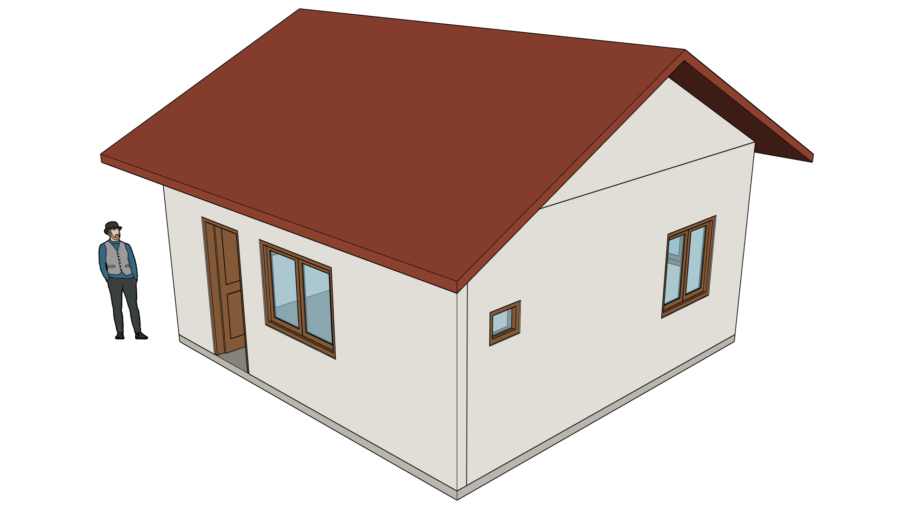
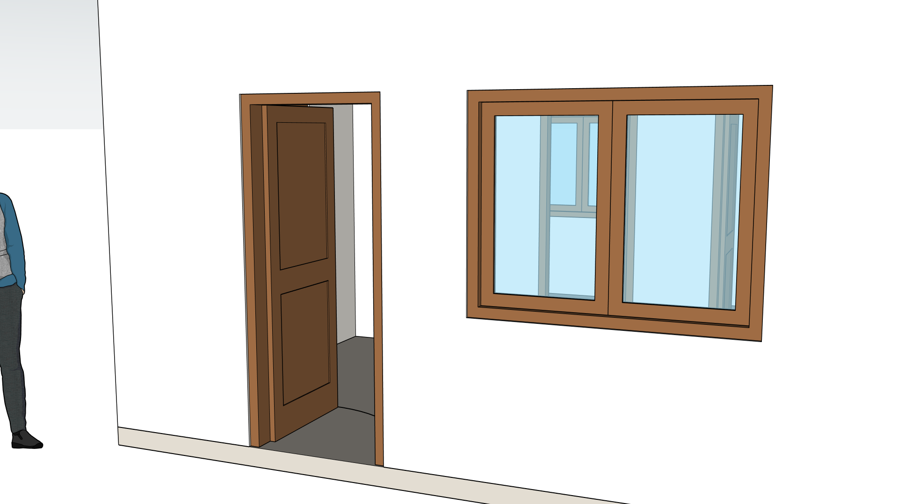
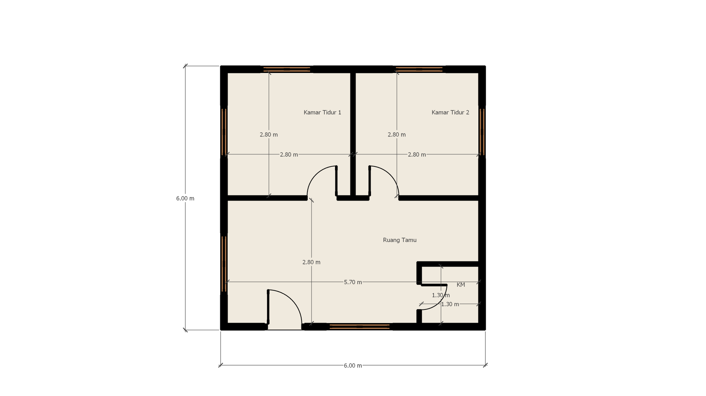

# SketchUp MCP untuk Windows

Menghubungkan **Claude Desktop** ke **SketchUp** di Windows, supaya Claude bisa memodelkan langsung di SketchUp, termasuk mengubah **denah menjadi model 3D** (dinding, bukaan pintu dan jendela, pelat lantai).

Ini adalah versi yang sudah diperbaiki dari [mhyrr/sketchup-mcp](https://github.com/mhyrr/sketchup-mcp) (lisensi MIT). Versi aslinya membuat SketchUp membeku di Windows; lihat [CHANGES.md](CHANGES.md).







> **Untuk Claude / agent AI yang diminta memasang ini:** ikuti [docs/INSTALL.md](docs/INSTALL.md) langkah demi langkah, lalu buat model contoh pertama di [docs/MODELING.md](docs/MODELING.md). Setiap model, termasuk model uji, wajib mengikuti [docs/STANDARDS.md](docs/STANDARDS.md) (tag, material, susunan grup) dan lolos audit.

## Pasang (satu perintah)

Buka **PowerShell** lalu jalankan:

```powershell
powershell -ExecutionPolicy Bypass -c "irm https://raw.githubusercontent.com/yonnayy/sketchup-mcp-windows/main/install.ps1 | iex"
```

Lalu:

1. Buka SketchUp dan buka sebuah model (lewati jendela Welcome). Server MCP menyala sendiri.
2. Tutup Claude Desktop sepenuhnya (ikon di tray > Quit), lalu buka lagi.
3. Periksa hasilnya:

```powershell
powershell -ExecutionPolicy Bypass -c "irm https://raw.githubusercontent.com/yonnayy/sketchup-mcp-windows/main/check.ps1 | iex"
```

Kalau semua baris `[PASS]`, coba ketik di Claude Desktop: *"Buat rumah 6 x 4 meter di SketchUp, tinggi dinding 3 meter, satu pintu di depan."*

Syarat: Windows 10/11, SketchUp desktop (bukan SketchUp Web), Claude Desktop. Diuji di SketchUp 2025; versi 2021 ke atas seharusnya jalan tetapi belum diuji.

## Tool yang tersedia

| Tool | Fungsi |
|---|---|
| `check_dimension_chains` | Sebelum memodelkan: memeriksa apakah deret ukuran di denah cocok dengan ukuran totalnya |
| `build_floor_plan` | Denah (dalam meter) menjadi dinding, pintu, jendela, dan pelat lantai, sudah dengan tag dan material baku. Ukuran bisa mengacu ke garis as, muka luar, atau muka dalam dinding; pintu dan jendela dibuat dengan kusen dan daun, dan pintu bisa diberi engsel dan arah bukaan |
| `verify_dimensions` | Sesudah memodelkan: mengukur model di SketchUp dan membandingkannya dengan denah (laporan akurasi) |
| `add_plan_view` | Tampak denah berdimensi: scene tampak atas yang memotong dinding, dengan angka ukuran dan nama ruang |
| `eval_ruby` | Menjalankan kode Ruby di SketchUp (akses penuh ke SketchUp Ruby API), termasuk helper `SU_MCP.element` dan `SU_MCP.audit_model` |
| `export_scene` | Ekspor png/jpg/skp/obj/dae/stl; mengembalikan path file. `png` dipakai untuk melihat hasil |
| `get_selection` | Daftar objek yang sedang dipilih pengguna |
| `create_component` | Primitif sederhana: cube, cylinder, sphere, cone |
| `transform_component` | Geser (relatif), putar, skala |
| `set_material` | Warna dasar |
| `delete_component` | Hapus objek berdasarkan ID |

## Dokumen

- [docs/INSTALL.md](docs/INSTALL.md): pemasangan langkah demi langkah dan cara verifikasi
- [docs/STANDARDS.md](docs/STANDARDS.md): aturan dasar model (tag, material, susunan grup) dan audit
- [docs/MODELING.md](docs/MODELING.md): cara kerja denah ke 3D, acuan ukuran dinding, laporan akurasi, model contoh pertama
- [docs/WORKFLOW.md](docs/WORKFLOW.md): panduan kerja untuk setiap proyek, dari membaca gambar sampai gambar hasil; cek tangga dan perabot, ekspor semua scene
- [docs/TROUBLESHOOTING.md](docs/TROUBLESHOOTING.md): gejala dan solusinya
- [CHANGES.md](CHANGES.md): apa yang diubah dari versi asli

## Lisensi

MIT, sama seperti proyek aslinya. Lihat [LICENSE](LICENSE).
