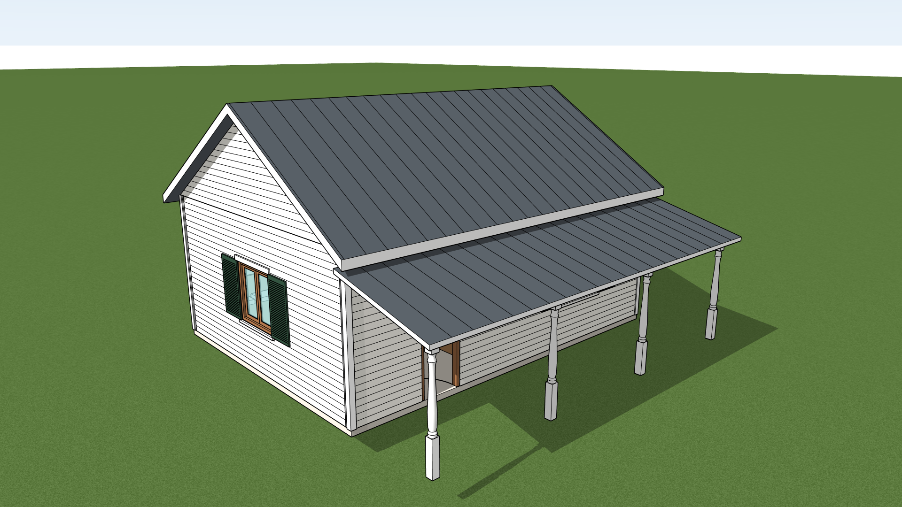

# Atap dan detail bangunan

Tool-tool ini mengerjakan bagian yang sebelumnya harus ditulis tangan lewat `eval_ruby`. Semuanya memakai **meter**, mengikuti [aturan dasar model](STANDARDS.md) (nama, tag, material, wadah), dan satu panggilan adalah satu langkah undo.

| Tool | Hasil | Tag |
|---|---|---|
| `build_roof` | Atap pelana, perisai, sandar, atau datar; garis rusuk seng; ampig | `05-Atap`, ampig `01-Dinding` |
| `add_siding` | Garis papan di muka luar dinding, papan sudut | (di dinding itu sendiri), papan sudut `06-Struktur` |
| `add_window_trim` | Lis atas, lis bawah, dan shutter berkisi di tiap jendela | `04-Jendela` |
| `add_posts` | Tiang teras: bubut, persegi, atau bulat | `06-Struktur` |
| `build_stairs` | Tangga dari rangkaian lurus, putar, dan bordes | `07-Tangga` |
| `place_furniture` | Perabot dan saniter sederhana, langsung dicek benturannya | `08-Furnitur` |
| `add_slab` | Pelat di atas denah apa saja: lantai atas berlubang tangga, dek, balok, kaki bangunan, halaman | sesuai `kind` |
| `add_plants` | Semak dan pohon sederhana | `09-Tapak` |
| `add_scene` | Scene perspektif, potongan, dan tampak untuk `export_views` | |

Urutan yang benar: dinding semua lantai (`build_floor_plan`) → `build_roof` → `add_posts` dan atap teras → `add_siding` → `add_window_trim` → `build_stairs` → `place_furniture` → `check_placement` → `SU_MCP.audit_model`. `add_siding` harus sebelum `add_window_trim`, dan setelah semua dinding (termasuk ampig) ada.

Semua angka dibaca dari gambar: kemiringan dan tinggi bubungan dari tampak atau potongan, posisi tiang dari denah teras, tangga dari denah tangga. Lihat [WORKFLOW.md](WORKFLOW.md).

Lewat `eval_ruby` nama dan isinya sama: `SU_MCP.build_roof('type' => 'gable', ...)`, `SU_MCP.add_siding(...)`, `SU_MCP.add_window_trim(...)`, `SU_MCP.add_posts(...)`, `SU_MCP.build_stairs(...)`, `SU_MCP.place_furniture(...)`.

## `build_roof`

```json
{
  "building": "Rumah A",
  "type": "gable",
  "from": [0, 0], "to": [8, 6],
  "base_z": 3.0,
  "pitch": "7.5:12",
  "overhang": 0.3, "rake": 0.25,
  "seams": 0.4,
  "gable_walls": true,
  "material": "Atap - Seng Abu", "color": [74, 80, 86],
  "name": "Atap Utama"
}
```

| Kunci | Arti | Default |
|---|---|---|
| `type` | `gable` (pelana), `hip` (perisai), `shed` (sandar), `flat` (datar) | `gable` |
| `from`, `to` | Dua sudut berseberangan dari **muka luar dinding** yang ditutup atap | wajib |
| `base_z` | Tinggi atas dinding. Sisi bawah atap melewati titik ini tepat di garis dinding | 0 |
| `pitch` | `"7.5:12"` (naik:datar), angka (`0.625`), atau `pitch_deg` dalam derajat | 0,5 |
| `overhang` | Teritisan di sisi talang | 0,3 |
| `rake` | Teritisan di sisi ampig (pelana dan sandar). Satu angka, atau `[awal, akhir]` kalau kedua ujung berbeda (misalnya 0 di ujung yang menempel ke bangunan lain) | sama dengan `overhang` |
| `thickness` | Tebal atap, tegak lurus bidangnya | 0,15 |
| `ridge` | Arah bubungan atap pelana: `"x"` atau `"y"` | sisi yang lebih panjang |
| `seams` | Jarak garis rusuk seng yang turun mengikuti kemiringan; 0 berarti tanpa garis | 0 |
| `gable_walls` | `true`, atau `{"thickness": 0.15, "material": "...", "ends": "both"}`: mengisi segitiga ampig dengan dinding. `ends`: `both`, `start`, atau `end` | tidak |
| `infill` | Daftar dinding pengisi antara dinding yang lebih rendah dan sisi bawah atap miring: `{"from": [x, y], "to": [x, y], "thickness": 0.1, "base_z": 2.54}` (garis as dinding, dan tinggi atas dinding di bawahnya). Untuk atap pelana dan sandar | |
| `fascia` | Tepi atap dicat putih (lisplang). `false` untuk mematikan, atau `[r, g, b]` | putih |
| `name`, `group` | Nama elemen dan wadahnya di dalam bangunan | `Atap <Type>`, `Atap` |

Atap sandar (`shed`) butuh `high_side` (`north`, `south`, `east`, `west`: sisi yang menempel ke dinding atau yang lebih tinggi) dan salah satu dari `base_z` (sisi bawah atap di garis dinding yang rendah) atau `top_z` (sisi bawah atap di tepi yang tinggi; ini yang biasanya terbaca di potongan teras).

**Teras keliling:** dua atap sandar bertemu di sudut luar dengan jurai 45 derajat kalau ujung yang bertemu diberi `"miter": {"start": true}` (ujung di x atau y terkecil) atau `{"end": true}`. Kedua persegi diberikan sampai ke sudut luar teras:

```json
{ "type": "shed", "name": "Atap Teras Selatan", "group": "Teras", "from": [-2, -2], "to": [7, 0],
  "high_side": "north", "top_z": 2.6, "pitch": 0.25, "miter": {"start": true} }
{ "type": "shed", "name": "Atap Teras Barat", "group": "Teras", "from": [-2, -2], "to": [0, 5],
  "high_side": "east", "top_z": 2.6, "pitch": 0.25, "miter": {"start": true} }
```

Jawaban menyebut tinggi **puncak bubungan** dan sisi bawah teritisan. Cocokkan dengan gambar tampak; gambar biasanya memberi tinggi bubungan ke puncak atap. Memanggil lagi dengan `name` yang sama mengganti atap itu.

Batasan: denah atap harus persegi dan sejajar sumbu. Rumah berbentuk L atau atap silang dibuat dari beberapa `build_roof`, satu per sayap; pertemuan lembahnya tidak dipotong (atap saling menembus, dari luar terlihat benar). Atap berbentuk lain tetap lewat `eval_ruby`.

## `add_siding`

```json
{ "building": "Rumah A", "style": "clapboard", "spacing": 0.125, "corner_boards": 0.09 }
```

| Kunci | Arti | Default |
|---|---|---|
| `style` | `clapboard` (papan susun mendatar) atau `batten` (bilah tegak) | `clapboard` |
| `spacing` | Tinggi papan, atau jarak bilah | 0,125 / 0,4 |
| `corner_boards` | Lebar papan sudut; `false` untuk tanpa papan sudut | 0,09 |
| `floor` | Hanya dinding lantai ini | semua |
| `only`, `skip` | Daftar id dinding (`"W1"`) | |
| `force` | Daftar id dinding yang semua mukanya dipapani, apa pun hasil ujinya | |

Muka luar dicari sendiri: dari tiap 25 cm dinding, tool melihat ke luar pada 15 arah. Kalau cukup banyak arah yang bebas dari dinding, pintu, dan jendela, potongan itu dianggap menghadap udara luar. Bagian dinding yang menghadap ruang, atau yang tertutup sayap bangunan lain, tidak dipapani. Garis berhenti di lubang pintu dan jendela.

Garis digambar di grup dinding itu sendiri, jadi tag dan material tidak berubah. Warna dinding diatur lewat `material` dinding di `build_floor_plan`. Jawaban menyebut dinding yang dipapani dan yang dianggap dinding dalam; **baca daftar itu**. Halaman dalam yang sempit (bentuk U) bisa terbaca sebagai ruang dalam: pakai `force`. Menjalankan lagi tidak menggandakan garis.

## `add_window_trim`

```json
{ "building": "Rumah A", "head": true, "sill": true, "shutters": true,
  "shutter_material": "Jendela - Shutter Hijau", "shutter_color": [38, 62, 48] }
```

Untuk tiap unit `Jendela ...` buatan `build_floor_plan`: lis atas 10 cm, lis bawah 5 cm, dan dua shutter selebar setengah jendela dengan garis kisi (`louvre`, default 3,5 cm; 0 untuk panel polos). Semua masuk ke dalam unit jendelanya (`Lis Atas`, `Lis Bawah`, `Shutter Kiri`, `Shutter Kanan`), di muka luar dinding. Jendela yang kedua sisinya terbuka atau kedua sisinya tertutup dilewati dan disebut di jawaban. Memanggil lagi mengganti lis yang lama.

## `add_posts`

```json
{ "building": "Rumah A", "group": "Teras", "points": [[0.1, -1.9], [2.7, -1.9]],
  "base_z": 0, "height": 2.4, "size": 0.14, "style": "turned" }
```

`style`: `turned` (bubut: kaki dan kepala persegi, tengahnya dibubut), `square`, `round`. Untuk tiang bubut, `foot` dan `cap` mengatur tinggi bagian persegi, dan `profile` (daftar `[posisi 0..1, jari-jari sebagai bagian dari size]`) mengganti bentuk bubutannya. Tiap tiang satu solid bernama `Tiang 1`, `Tiang 2`, dan seterusnya (`name` mengganti awalannya). Memanggil lagi dengan nama yang sama mengganti tiang-tiang itu.

## `build_stairs`

```json
{
  "building": "Rumah A",
  "start": [6.5, 1.0], "direction": 90,
  "base_z": 0, "rise": 3.0, "risers": 16,
  "width": 0.9, "tread": 0.25,
  "segments": [
    {"type": "flight", "treads": 9},
    {"type": "winder", "turn": "left", "steps": 3},
    {"type": "flight", "treads": 3}
  ],
  "material": "Tangga - Kayu", "color": [168, 124, 82]
}
```

| Kunci | Arti |
|---|---|
| `start` | Titik tengah **anak tangga pertama** (garis tanjakan pertama) |
| `direction` | Arah naik dalam derajat: 0 = +x, 90 = +y, 180 = -x, 270 = -y |
| `rise`, `risers` | Tinggi lantai ke lantai dan jumlah tanjakan. Tinggi tanjakan = `rise / risers` |
| `segments` | Bagian tangga berurutan dari bawah |

Jenis bagian:

- `{"type": "flight", "treads": n}`: tangga lurus `n` injakan.
- `{"type": "winder", "turn": "left" | "right", "steps": 3}`: belok 90 derajat dengan anak tangga berbentuk baji.
- `{"type": "landing", "turn": "left" | "right"}`: bordes persegi yang berbelok. Tanpa `turn`, bordes lurus sepanjang `length`.

Tiap baji dan tiap bordes dihitung satu injakan. **Jumlah injakan semua bagian harus `risers - 1`**, karena lantai atas adalah injakan terakhir; kalau tidak cocok, jawaban berisi `WARNING`. Contoh di atas: 9 + 3 + 3 = 15 untuk 16 tanjakan.

Jawaban menyebut titik tiba di lantai atas dan tapak tangga (`Footprint x .. y ..`). **Pelat lantai atas harus berlubang di situ:** keluarkan area itu dari `slab.outline` lantai atas di `build_floor_plan`. Sesudahnya jalankan `check_placement`.

## `place_furniture`

```json
{
  "building": "Rumah A", "floor": "Lantai 1", "base_z": 0,
  "items": [
    {"type": "bed", "at": [1.2, 4.8]},
    {"type": "sofa", "at": [5.2, 0.65], "rotation": 180},
    {"type": "table", "at": [5.2, 4.4], "size": [1.4, 0.8, 0.75], "name": "Meja Makan"}
  ]
}
```

| `type` | Lebar x dalam x tinggi (m) | Bagian belakang |
|---|---|---|
| `bed` | 1,6 x 2,0 x 0,5 | kepala ranjang |
| `sofa` | 2,0 x 0,9 x 0,8 | sandaran |
| `table`, `desk` | 1,6 x 0,9 x 0,75 dan 1,2 x 0,6 x 0,75 | |
| `chair` | 0,45 x 0,45 x 0,9 | sandaran |
| `cabinet`, `wardrobe` | 1,2 x 0,6 x 0,9 dan 1,2 x 0,6 x 2,0 | |
| `fridge`, `stove` | 0,7 x 0,7 x 1,8 dan 0,6 x 0,6 x 0,9 | |
| `toilet` | 0,4 x 0,7 x 0,8 | tangki |
| `sink` | 0,6 x 0,5 x 0,85 | |
| `bathtub`, `shower` | 0,75 x 1,7 x 0,55 dan 0,9 x 0,9 x 0,08 | |

`at` adalah titik tengah perabot. Pada `rotation` 0 lebar searah x dan **bagian belakang menghadap utara (+y)**. Rotasi dalam derajat berlawanan arah jarum jam: 180 membuat belakangnya menempel dinding selatan, 90 dinding barat, -90 dinding timur. `size`, `name`, `material`, dan `color` bisa diatur per perabot; `z` untuk lantai yang berbeda dari `base_z`.

Ini perabot massa untuk denah dan gambar potongan, bukan model detail. Jawaban ditutup dengan laporan `check_placement`: perbaiki setiap `PLACEMENT CONFLICT`. Perabot dengan nama yang sama di wadah yang sama diganti, jadi memindahkan perabot cukup dengan memanggil lagi dengan `name` yang sama.

## `add_slab`

```json
{ "building": "Rumah A", "floor": "Lantai 2", "name": "Lantai",
  "outline": [[0.1, 0.1], [7.2, 0.1], [7.2, 2.3], [6.3, 2.3], [6.3, 4.8], [0.1, 4.8]],
  "top_z": 2.74, "thickness": 0.3, "material": "Lantai - Kayu", "color": [176, 132, 88] }
```

Pelat dari `top_z - thickness` sampai `top_z`, di atas `outline` (atau `from` dan `to` untuk persegi). `kind` menentukan tagnya: `lantai` (default), `struktur` (balok, kaki bata), `tapak` (halaman, setapak; tanpa `building` masuk ke wadah `Tapak`), `atap`. `floor` atau `group` menentukan wadahnya di dalam bangunan.

Pemakaian utamanya: **lantai atas yang berlubang di atas tangga**. `build_floor_plan` lantai atas dipanggil tanpa `slab`, lalu lantainya dibuat dengan `add_slab` memakai denah yang sudah dikurangi tapak tangga dari jawaban `build_stairs`. Pelat dengan nama yang sama di wadah yang sama diganti.

## `add_plants`

```json
{ "base_z": -0.6, "items": [
  {"type": "shrub", "at": [1.0, -2.5], "size": 1.3},
  {"type": "tree", "at": [-8.4, 6.6], "size": 4.5, "height": 7.6} ] }
```

`shrub` (semak, `size` = diameter) dan `tree` (pohon dengan batang dan tajuk). Semuanya masuk ke wadah `Tapak` dengan tag `09-Tapak`, jadi tersembunyi di denah dan bisa disembunyikan di tampak.

## `add_scene`

```json
{ "name": "Potongan Lantai 1", "eye": [1.0, -6.6, 14.2], "target": [3.8, 3.0, 0], "cut_z": 2.44 }
{ "name": "Tampak Selatan", "eye": [3.66, -22.9, 2.8], "target": [3.66, 0, 2.8], "height": 10.7, "hide": ["tapak"] }
```

| Kunci | Arti |
|---|---|
| `eye`, `target` | Posisi kamera dan titik yang dilihat |
| `fov` | Sudut pandang perspektif (default 38) |
| `height` | Sebagai ganti perspektif: proyeksi paralel yang memperlihatkan sekian meter (untuk tampak) |
| `cut_z` | Potongan mendatar: semua di atas tinggi ini dibuang. Taruh sedikit di bawah plafon lantai yang mau diperlihatkan, dan di bawah teritisan atap |
| `hide` | Jenis elemen yang disembunyikan di scene ini, misalnya `["tapak"]` atau `["atap"]` |
| `shadows` | Default: menyala untuk perspektif, mati untuk paralel |

Anotasi denah otomatis tersembunyi di scene ini. Scene perspektif juga memberi model warna langit dan tanah. Memanggil lagi dengan nama yang sama memperbarui scene. Denah berdimensi tetap dibuat dengan `add_plan_view`.

Rumah dua lantai yang memakai semua tool ini: [Caroline's Farmhouse](../examples/caroline/README.md).

## Contoh lengkap

Rumah satu lantai 8 x 6 m dengan teras di selatan, setelah `build_floor_plan` (dinding `W1` sampai `W5`, tinggi 3,0 m):

1. `build_roof`: contoh pelana di atas. Jawaban: `top of ridge at +5.052 m`, `44 seam lines`, `2 gable walls`.
2. `add_posts`: empat tiang di `y = -1.9`, tinggi 2,2 m.
3. `build_roof` teras: `{"type": "shed", "group": "Teras", "name": "Atap Teras", "from": [0, -2], "to": [8, 0], "high_side": "north", "top_z": 2.7, "pitch": "3:12", "overhang": 0.2, "thickness": 0.08, "seams": 0.4}`.
4. `add_siding`: `{"building": "Rumah A"}`. Jawaban menyebut `W1, W2, W3, W4` dan kedua ampig, 4 papan sudut, dan `No outside face found on: W5`.
5. `add_window_trim`: `{"building": "Rumah A"}`.
6. `build_stairs` dan `place_furniture` seperti contoh di atas, lalu `check_placement`.
7. `SU_MCP.audit_model` harus `AUDIT OK`, lalu scene dan `export_views`.

Hasilnya:



Uji otomatisnya, dengan angka yang sama: `tests/live_detail.py`.
