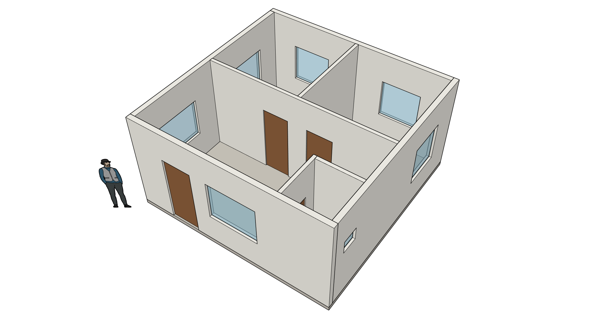

# Memodelkan dari denah ke 3D

Panduan untuk Claude saat diminta membuat model SketchUp dari denah.

**Baca [STANDARDS.md](STANDARDS.md) dulu.** Aturan tag, material, dan susunan grup di sana berlaku sejak model pertama, termasuk model uji.

## Alur kerja

1. **Baca denahnya** (gambar, PDF, atau deskripsi). Tentukan titik asal `[0, 0]`, biasanya sudut kiri bawah bangunan, dengan sumbu x ke kanan dan y ke atas pada denah.
2. **Cek rantai dimensi** dengan `check_dimension_chains`: setiap deret ukuran di denah harus sama dengan ukuran totalnya. Kalau ada yang `KONFLIK`, tunjukkan ke pengguna dan tanyakan angka mana yang benar. Jangan mulai memodelkan sebelum ini beres.
3. **Tanyakan yang tidak tertulis di denah**, jangan menebak: ukuran yang tidak terbaca, tinggi dinding, tebal dinding, tinggi pintu, tinggi ambang dan tinggi jendela. Kalau pengguna tidak tahu, pakai nilai umum di bawah dan sebutkan bahwa itu asumsi.
4. **Tentukan acuan ukuran tiap dinding** (`ref`): ukuran di denah itu diukur ke garis as, ke muka luar, atau ke muka dalam? Lihat [Acuan ukuran dinding](#acuan-ukuran-dinding). Ini sumber kesalahan paling umum.
5. **Susun daftar dinding dan bukaan** dalam meter, beri `id` tiap dinding. `offset` bukaan adalah jarak dari titik `from` dinding ke tepi terdekat bukaan.
6. **Panggil `build_floor_plan`** sekali untuk satu lantai, dengan `building` berisi nama bangunan. Baca jawabannya: bagian `Warnings` harus kosong.
7. **Buat laporan akurasi** dengan `verify_dimensions`: ukuran luar dan ukuran bersih tiap ruang, dibandingkan dengan denah. Semua baris harus `OK`. Sampaikan laporan ini ke pengguna.
8. **Tambahkan yang lain** (atap, kolom, tangga) lewat `eval_ruby` dengan `SU_MCP.element`, di dalam wadah bangunan yang sama.
9. **Audit:** `SU_MCP.audit_model` harus menjawab `AUDIT OK`.
10. **Lihat hasilnya** dengan `export_scene` format `png`, lalu perbaiki kalau ada yang salah (Ctrl+Z di SketchUp membatalkan satu langkah sekaligus).

Nilai umum kalau tidak disebutkan: tinggi dinding 3,0 m; tebal dinding bata 0,15 m, sekat 0,10 m; pintu 0,9 x 2,1 m; jendela lebar 1,2 m, ambang 0,9 m, tinggi 1,2 m; pelat lantai 0,12 m.

## Acuan ukuran dinding

Garis `from` ke `to` sebuah dinding bisa berarti tiga hal, dan `ref` menyatakan yang mana. Kiri dan kanan dilihat sambil berjalan dari `from` ke `to`.

| `ref` | Garis `from` ke `to` adalah | Badan dinding berada |
|---|---|---|
| `"center"` (bawaan) | garis as (tengah dinding) | setengah tebal di kiri, setengah di kanan |
| `"left"` | muka kiri dinding | di sebelah kanan garis |
| `"right"` | muka kanan dinding | di sebelah kiri garis |

Pilih sesuai cara denah diberi ukuran:

| Ukuran di denah | Cara menyusun dinding | Hasil |
|---|---|---|
| Ukuran **luar** bangunan (6 x 6 m dari muka luar ke muka luar) | Telusuri keliling **berlawanan arah jarum jam**, `"ref": "right"` | Ukuran luar persis 6,00 x 6,00 |
| Ukuran **bersih** ruang (kamar 3 x 3 m dari muka dalam ke muka dalam) | Telusuri keliling ruang **berlawanan arah jarum jam**, `"ref": "left"` | Ukuran bersih persis 3,00 x 3,00 |
| Ukuran **as ke as** (grid kolom atau garis as dinding) | `"ref": "center"` | Jarak as persis; ukuran luar bertambah setebal dinding |

Kalau acuannya salah, selisihnya sebesar setengah sampai satu tebal dinding per dinding, dan menumpuk makin ke dalam bangunan. Kalau denah tidak jelas memakai acuan yang mana, tanyakan ke pengguna.

Dinding dalam satu denah boleh berbeda acuan, misalnya dinding luar `"right"` dan sekat `"center"`. `"wall_ref"` di tingkat atas mengubah bawaan untuk semua dinding.

**Sambungan dinding diurus otomatis.** Di sudut, satu dinding mengisi sudut dan yang lain berhenti di mukanya. Di pertemuan T, dinding yang menempel berhenti di muka dinding yang ditempeli. Jadi sudut selalu tertutup dan tidak ada dinding yang tumpang-tindih, apa pun acuannya. `offset` bukaan tetap diukur dari titik `from` yang kamu tulis, bukan dari ujung dinding setelah disambung.

## Cek rantai dimensi

Panggil `check_dimension_chains` sebelum memodelkan. Tidak butuh SketchUp.

```json
[
  {"label": "Sisi selatan", "segments": [1.0, 0.9, 0.5, 1.5, 2.1], "total": 6.0},
  {"label": "Sisi barat", "segments": [0.9, 1.2, 1.7, 1.4, 0.8], "total": 6.0}
]
```

```
CHAINS OK. All 2 dimension strings add up within 5 mm.
OK             Sisi selatan: 1 + 0.9 + 0.5 + 1.5 + 2.1 = 6.000 m, overall 6.000 m
OK             Sisi barat: 0.9 + 1.2 + 1.7 + 1.4 + 0.8 = 6.000 m, overall 6.000 m
```

Kalau ada yang tidak cocok:

```
CHAINS CONFLICT. 1 of 2 dimension strings do not add up. Ask the user which number is right before modelling.
KONFLIK        Sisi kiri: 3 + 2.9 = 5.900 m, but overall says 6.000 m (-100 mm)
```

## Format `build_floor_plan`

Semua angka dalam **meter**.

```json
{
  "building": "Rumah A",
  "name": "Lantai 1",
  "wall_height": 3.0,
  "wall_thickness": 0.15,
  "wall_ref": "center",
  "base_z": 0,
  "walls": [
    {"id": "W1", "from": [0, 0], "to": [6, 0], "ref": "right"},
    {"id": "W2", "from": [6, 0], "to": [6, 4], "ref": "right", "thickness": 0.1, "height": 2.8}
  ],
  "openings": [
    {"wall": "W1", "type": "door", "offset": 1.0, "width": 0.9, "height": 2.1},
    {"wall": "W2", "type": "window", "offset": 1.2, "width": 1.5, "sill": 0.9, "height": 1.2}
  ],
  "slab": {"outline": [[0, 0], [6, 0], [6, 4], [0, 4]], "thickness": 0.12}
}
```

| Kunci | Arti |
|---|---|
| `building` | Nama grup wadah bangunan. Dibuat kalau belum ada; lantai berikutnya dengan nama yang sama masuk ke wadah yang sama |
| `name` | Nama grup lantai. Pakai nama berbeda tiap lantai |
| `wall_height`, `wall_thickness` | Nilai bawaan, bisa ditimpa per dinding lewat `height` dan `thickness` |
| `wall_ref` | Acuan bawaan untuk semua dinding: `"center"`, `"left"`, atau `"right"` |
| `base_z` | Elevasi lantai. Lantai 2 misalnya `3.2` |
| `walls[].from`, `walls[].to` | Ujung garis dinding `[x, y]` |
| `walls[].ref` | Acuan garis itu, lihat [Acuan ukuran dinding](#acuan-ukuran-dinding) |
| `walls[].extend` | Biasanya tidak perlu diisi. `false` mematikan sambungan otomatis untuk dinding itu; angka atau `[awal, akhir]` (meter) memanjangkan atau, kalau negatif, memendekkan ujungnya |
| `walls[].material` | Material lain untuk dinding itu, misalnya `"Dinding - Bata Ekspos"`. Material yang belum ada dibuat dengan warna bawaan dinding; buat dulu lewat `SU_MCP.material(:dinding, 'Dinding - Bata Ekspos', [165, 80, 60])` kalau warnanya harus beda |
| `openings[].wall` | `id` dinding tempat bukaan |
| `openings[].offset` | Jarak dari titik `from` dinding ke tepi bukaan |
| `openings[].sill` | Tinggi ambang. Tanpa `sill` (atau 0) berarti pintu; dengan `sill` berarti jendela |
| `openings[].height` | Tinggi bukaan, diukur dari ambang |
| `infill` | Bawaan `true`: tiap pintu diisi daun pintu 4 cm dan tiap jendela diisi kaca 1 cm. Isi `false` untuk lubang saja |
| `slab.outline` | Titik keliling pelat lantai. Permukaan atas pelat ada di `base_z` |
| `slab.material` | Material lain untuk pelat, misalnya `"Lantai - Kayu"` |

Hasilnya mengikuti [STANDARDS.md](STANDARDS.md): satu grup per dinding (`Dinding W1`) di tag `01-Dinding`, daun pintu (`Pintu W1-1`) di `03-Pintu`, kaca jendela (`Jendela W1-1`) di `04-Jendela`, dan `Lantai` di `02-Lantai`, masing-masing dengan material bakunya. Setiap elemen adalah solid tertutup.

Batasan: dinding lurus saja (dinding lengkung dipecah jadi beberapa segmen pendek), sambungan otomatis dihitung untuk dinding yang bertemu tegak lurus (pertemuan miring ditutup secara pendekatan), bukaan persegi, daun pintu dan kaca berupa panel polos tanpa kusen dan tanpa arah ayun, tidak membuat atap. Untuk itu pakai `eval_ruby`.

## Laporan akurasi

Panggil `verify_dimensions` setelah `build_floor_plan`. Tool ini **mengukur model yang sudah jadi** di SketchUp, bukan menghitung ulang dari data yang kamu kirim, jadi kesalahan acuan atau salah ketik koordinat akan terlihat.

| Bentuk cek | Yang diukur |
|---|---|
| `{"label": "Panjang luar", "overall": "x", "expected": 6.0}` | Ukuran luar semua dinding searah x atau y. `"building"` dan `"floor"` (nama grup) membatasi dinding yang dihitung |
| `{"label": "Kamar tidur 1", "at": [1.5, 4.5], "expected": [2.8, 2.8]}` | Ukuran bersih ruang lewat titik itu: `[searah x, searah y]` |
| `{"label": "Lebar koridor", "at": [3, 2], "axis": "y", "expected": 1.2}` | Satu jarak bersih; `axis` berisi `"x"`, `"y"`, atau sudut dalam derajat |

`at` adalah titik mana pun di dalam ruang, jangan menempel di dinding. Jarak bersih diukur antar muka dinding; daun pintu, kaca, dan perabot diabaikan, dan bukaan pintu atau jendela tidak mengacaukan ukuran. Untuk lantai atas tambahkan `"z"` (elevasi lantai). Tanpa `expected`, tool hanya membaca ukurannya.

Cek minimal untuk setiap denah: dua ukuran luar, dan ukuran bersih **setiap** ruang. Toleransi bawaan 5 mm.

```
VERIFY FAILED. 1 of 2 dimensions match the plan within 5 mm.
OK             Kamar tidur 1 (arah y): plan 2.800 m, model 2.800 m (+0 mm)
SELISIH        Kamar tidur 1 (arah x): plan 3.000 m, model 2.800 m (-200 mm)
```

Kalau ada `SELISIH`, cari penyebabnya (biasanya `ref` yang salah atau koordinat dinding), batalkan dengan Ctrl+Z atau hapus grup lantainya, bangun ulang, lalu ukur lagi. Kalau selisihnya memang berasal dari konflik di denah, tulis itu di laporan ke pengguna.

## Model contoh pertama

Ini model uji setelah pemasangan, sekaligus contoh cara kerja yang benar. Kerjakan langkah-langkah ini berurutan di model kosong.




Rumah 6 x 6 m diukur dari **muka luar**: ruang tamu, dua kamar tidur, dan kamar mandi. Dinding luar 15 cm ditelusuri berlawanan arah jarum jam dengan `"ref": "right"`; sekat 10 cm memakai garis as.

### Langkah 1: cek rantai dimensi

Panggil `check_dimension_chains` dengan dua rantai di bagian [Cek rantai dimensi](#cek-rantai-dimensi). Jawabannya harus `CHAINS OK. All 2 dimension strings add up within 5 mm.`

### Langkah 2: denah

Panggil `build_floor_plan` dengan:

```json
{
  "building": "Rumah Contoh",
  "name": "Lantai 1",
  "wall_height": 3,
  "wall_thickness": 0.15,
  "walls": [
    {"id": "W1", "from": [0, 0], "to": [6, 0], "ref": "right"},
    {"id": "W2", "from": [6, 0], "to": [6, 6], "ref": "right"},
    {"id": "W3", "from": [6, 6], "to": [0, 6], "ref": "right"},
    {"id": "W4", "from": [0, 6], "to": [0, 0], "ref": "right"},
    {"id": "W5", "from": [0, 3], "to": [6, 3], "thickness": 0.1},
    {"id": "W6", "from": [3, 3], "to": [3, 6], "thickness": 0.1},
    {"id": "W7", "from": [4.5, 0], "to": [4.5, 1.5], "thickness": 0.1},
    {"id": "W8", "from": [4.5, 1.5], "to": [6, 1.5], "thickness": 0.1}
  ],
  "openings": [
    {"wall": "W1", "type": "door", "offset": 1, "width": 0.9, "height": 2.1},
    {"wall": "W1", "type": "window", "offset": 2.4, "width": 1.5, "sill": 0.9, "height": 1.2},
    {"wall": "W5", "type": "door", "offset": 1.9, "width": 0.8, "height": 2.1},
    {"wall": "W5", "type": "door", "offset": 3.3, "width": 0.8, "height": 2.1},
    {"wall": "W4", "type": "window", "offset": 0.9, "width": 1.2, "sill": 0.9, "height": 1.2},
    {"wall": "W4", "type": "window", "offset": 3.8, "width": 1.4, "sill": 0.9, "height": 1.2},
    {"wall": "W2", "type": "window", "offset": 3.9, "width": 1.2, "sill": 0.9, "height": 1.2},
    {"wall": "W2", "type": "window", "offset": 0.5, "width": 0.5, "sill": 1.6, "height": 0.4},
    {"wall": "W7", "type": "door", "offset": 0.4, "width": 0.7, "height": 2},
    {"wall": "W3", "type": "window", "offset": 0.9, "width": 1.2, "sill": 0.9, "height": 1.2},
    {"wall": "W3", "type": "window", "offset": 3.9, "width": 1.2, "sill": 0.9, "height": 1.2}
  ],
  "slab": {"outline": [[0, 0], [6, 0], [6, 6], [0, 6]], "thickness": 0.12}
}
```

Jawaban yang benar: `Built 'Lantai 1': 8 walls, 4 doors, 7 windows, 1 slab. Size 6.0 x 6.0 x 3.12 m (x, y, z).`

### Langkah 3: laporan akurasi

Panggil `verify_dimensions` dengan:

```json
[
  {"label": "Panjang luar", "overall": "x", "expected": 6.0},
  {"label": "Lebar luar", "overall": "y", "expected": 6.0},
  {"label": "Ruang tamu", "at": [2.0, 2.5], "expected": [5.7, 2.8]},
  {"label": "Kamar tidur 1", "at": [1.5, 4.5], "expected": [2.8, 2.8]},
  {"label": "Kamar tidur 2", "at": [4.5, 4.5], "expected": [2.8, 2.8]},
  {"label": "Kamar mandi", "at": [5.2, 0.75], "expected": [1.3, 1.3]}
]
```

Jawaban yang benar: `VERIFY OK. 10 of 10 dimensions match the plan within 5 mm.` Perhatikan bahwa kamar tidur bersihnya 2,80 m, bukan 3,00 m: dari grid 3 m dikurangi dinding luar 15 cm dan setengah sekat 5 cm. Inilah yang dimaksud dengan acuan ukuran.

### Langkah 4: atap dan ampig

Panggil `eval_ruby` dengan kode ini. Atap pelana dengan teritis 0,6 m, dua dinding ampig di atas dinding barat dan timur, dan figur skala bawaan template dipindah ke tag referensi. Semua elemen dibuat lewat `SU_MCP.element`, di dalam wadah bangunan yang sama.

```ruby
model = Sketchup.active_model
model.start_operation('MCP: Atap', true)
rumah = SU_MCP.container('Rumah Contoh')
o = 0.6
SU_MCP.element('Atap Pelana', :atap, rumah) do |ents|
  x = (-o).m
  profil = [[-o, 2.7], [3, 4.5], [6 + o, 2.7], [6 + o, 2.82], [3, 4.62], [-o, 2.82]]
  face = ents.add_face(profil.map { |y, z| Geom::Point3d.new(x, y.m, z.m) })
  panjang = (6 + 2 * o).m
  face.pushpull(face.normal.x > 0 ? panjang : -panjang)
end
[['Dinding Ampig Barat', 0.0], ['Dinding Ampig Timur', 5.85]].each do |nama, x0|
  SU_MCP.element(nama, :dinding, rumah) do |ents|
    x = x0.m
    face = ents.add_face([x, 0.m, 3.m], [x, 6.m, 3.m], [x, 3.m, 4.5.m])
    face.pushpull(face.normal.x > 0 ? 0.15.m : -0.15.m)
  end
end
figur = model.entities.grep(Sketchup::ComponentInstance).first
figur.layer = SU_MCP.tag(:referensi) if figur
model.commit_operation
SU_MCP.audit_model
```

Jawaban yang benar: `AUDIT OK. 23 elements and 2 containers checked. All rules satisfied.`

### Langkah 5: lihat hasilnya

Atur sudut pandang dengan satu panggilan `eval_ruby`:

```ruby
Sketchup.send_action('viewIso:')
'ok'
```

lalu satu panggilan lagi:

```ruby
Sketchup.active_model.active_view.zoom_extents
'ok'
```

lalu panggil `export_scene` dengan `format: "png"` dan baca gambarnya. Untuk melihat ke dalam, matikan tag atap dulu: `Sketchup.active_model.layers['05-Atap'].visible = false`. Di sinilah aturan tag terasa gunanya.

## Aturan saat memakai `eval_ruby`

Untuk atap, tangga, kolom, furnitur, dan apa pun di luar `build_floor_plan`.

1. **Buat setiap elemen lewat `SU_MCP.element`**, bukan `add_group` langsung, supaya tag dan materialnya benar. Lihat [STANDARDS.md](STANDARDS.md#helper-di-eval_ruby).
2. **Satuan internal SketchUp adalah inci.** Selalu tulis `3.m`, `150.mm`, `15.cm`. Angka polos seperti `3` berarti 3 inci. Untuk membaca balik: `panjang.to_m`.
3. **Bungkus perubahan dalam satu operasi** (`model.start_operation('Nama', true)` sampai `model.commit_operation`) supaya pengguna bisa membatalkannya dengan satu kali Ctrl+Z.
4. **Face di z = 0 menghadap ke bawah.** `pushpull` dengan angka positif akan masuk ke bawah tanah. Sebelum `pushpull`: `face.reverse! if face.normal.z < 0`.
5. **Akhiri kode dengan `SU_MCP.audit_model`** atau ringkasan (jumlah objek dan ukuran) supaya hasilnya bisa diperiksa. Nilai ekspresi terakhir yang dikembalikan.
6. **Satu panggilan paling lama sekitar 15 detik.** Pecah pekerjaan besar jadi beberapa panggilan.
7. **Untuk mencoba tanpa mengotori model:** pakai `model.start_operation('coba', true)` lalu `model.abort_operation` di akhir.

## Jebakan tool lain

- `create_component`, `set_material`: hasilnya **tidak** mengikuti aturan tag dan material, jadi audit akan gagal. Pakai hanya untuk coba-coba cepat, bukan untuk model yang akan disimpan.
- `create_component`: `position` dan `dimensions` dalam **inci**. Untuk `cylinder`, `position` adalah sudut kotak pembatasnya, bukan titik pusat. Kubus di z = 0 terbentuk ke arah bawah.
- `transform_component`: `position` adalah pergeseran **relatif**, bukan posisi tujuan.
- `export_scene`: file ditulis ke folder `sketchup_exports` di dalam `%TEMP%`, dan path lengkapnya ada di jawaban. Perubahan sudut pandang baru berlaku setelah panggilan `eval_ruby` selesai, jadi atur kamera, `zoom_extents`, dan `export_scene` sebagai panggilan terpisah.
