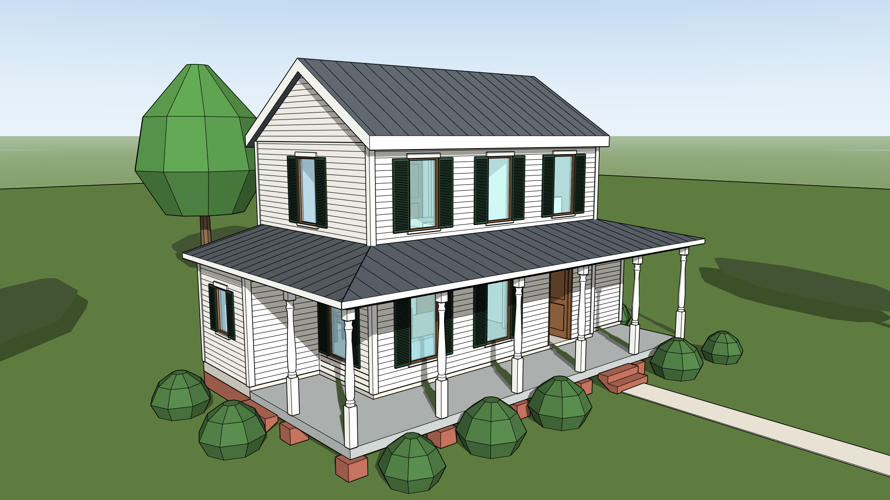
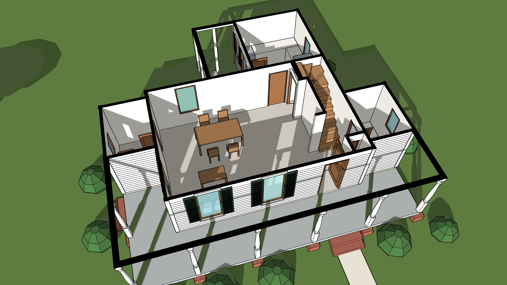
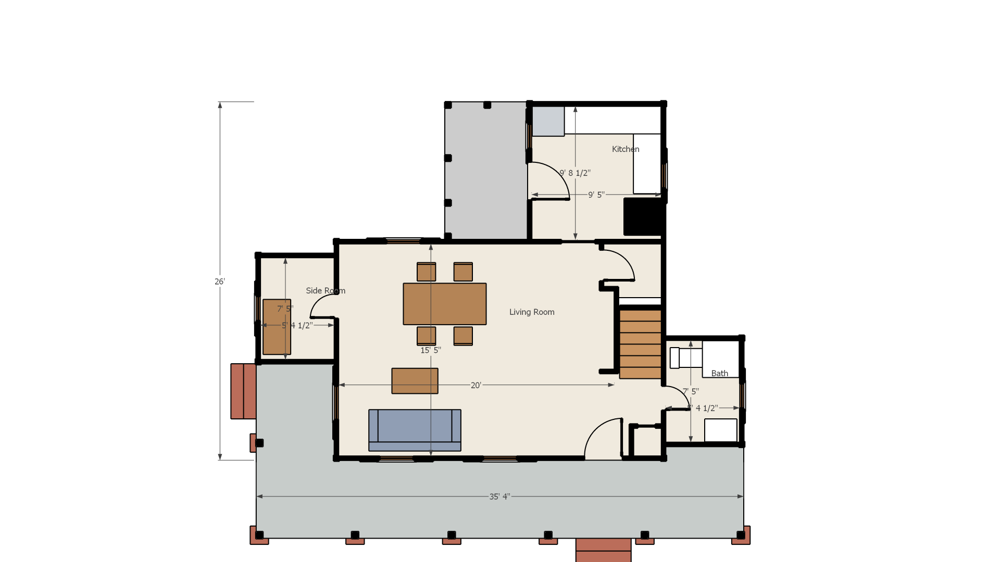

# Uji modelling: Caroline's Farmhouse

Rumah pertanian dua lantai dari gambar kerja sungguhan, dibangun **hanya dengan tool MCP**: 42 panggilan, tanpa Ruby tulis tangan. Ini uji modelling utama repo ini, dijalankan setelah [model contoh pertama](../../docs/MODELING.md#model-contoh-pertama) lolos.



| | |
|---|---|
|  |  |

## Sumber dan lisensi

Rancangan: **Caroline's Farmhouse, The Original Starter Farmhouse Plans**, oleh Jay Osborne, [FreeFarmhouse.com](https://www.freefarmhouse.com). Lisensi [CC BY-SA 4.0](https://creativecommons.org/licenses/by-sa/4.0/).

`make_steps.py`, `caroline.json`, dan gambar hasil di folder ini adalah karya turunan dari gambar itu dan memakai lisensi yang sama (CC BY-SA 4.0), terpisah dari lisensi kode repo ini. Gambar kerja aslinya tidak disalin ke sini; unduh dari situs di atas kalau ingin mencocokkan.

## Isi folder

| File | Isi |
|---|---|
| `caroline.json` | 42 langkah: nama tool, argumennya (meter), catatan, dan teks yang harus ada di jawabannya (`expect`) |
| `make_steps.py` | Sumber `caroline.json`. Semua angka di sini dalam **inci**, seperti di gambar, dengan keterangan lembar asalnya |
| `build.py` | Menjalankan semua langkah lewat MCP dan memeriksa jawabannya |

Titik asal: sudut luar barat daya badan utama 24' x 16'. Sumbu x ke timur, y ke utara, teras depan di selatan. `z = 0` adalah lantai bawah.

## Cara menjalankan

**1. Buka model baru yang kosong di SketchUp.** Pembangunan tidak menghapus apa pun, jadi jangan dijalankan di model yang berisi pekerjaan lain. Hapus figur orang bawaan template (pilih, Delete), lalu simpan modelnya (misalnya `caroline.skp`): gambar hasil akan ditaruh di folder `<nama model>-gambar` di sebelahnya.

**2a. Sebagai Claude (cara yang diuji di sini):** baca `caroline.json`, lalu panggil tool tiap langkah **berurutan**, dengan `args` apa adanya. Baca setiap jawaban dan cocokkan dengan `expect`. Kalau ada yang tidak cocok, berhenti dan laporkan langkah itu; jangan melanjutkan.

**2b. Sebagai skrip:**

```powershell
uv run --project . python examples/caroline/build.py
```

Baris terakhir harus `ALL STEPS AS EXPECTED`. Di PC uji, ke-42 langkah selesai dalam sekitar 15 detik.

**3. Buka dan lihat kesembilan gambar** di folder `-gambar`, lalu tunjukkan ke pengguna bersama laporan di bawah.

## Urutan dan jawaban yang diharapkan

| Langkah | Tool | Yang dibuat | Jawaban harus memuat |
|---|---|---|---|
| 1-2 | `build_floor_plan` | Dinding dan bukaan dua lantai (lembar A1.1, A1.2) | `20 walls, 7 doors, 8 windows, 1 slab`; `14 walls, 6 doors, 7 windows` |
| 3 | `add_slab` | Lantai atas, berlubang di atas tangga | `Slab 'Lantai' (lantai) built in 'Lantai 2'` |
| 4 | `verify_dimensions` | Laporan akurasi | `15 of 17 dimensions match` |
| 5 | `build_roof` | Atap utama 7,5:12 dengan dua ampig | `top of ridge at +7.010 m` (23'-0") |
| 6-8 | `build_roof` | Atap teras keliling 3:12 dengan jurai di dua sudut, menerus di atas side room dan bath | `3 infill walls` |
| 9 | `build_roof` | Atap belakang di atas dapur dan screen porch | `1 gable walls`, `1 infill walls` |
| 10-20 | `add_slab`, `add_posts` | Kaki bata, dek teras, umpak, 7 tiang bubut, balok, screen porch | |
| 21-22 | `build_stairs` | Dua tangga bata ke teras | `3 risers of 0.1778 m` |
| 23-24 | `build_stairs`, `add_slab` | Tangga putar dalam (`14 R @ 7.7"`) dan platform lemari di atasnya | `14 risers of 0.1959 m, 13 treads in 3 parts` |
| 25 | `add_siding` | Papan susun dan papan sudut | 27 dinding dipapani; 17 dinding dalam disebut `No outside face found` |
| 26 | `add_window_trim` | Lis dan shutter | `added to 15 of 15 windows` |
| 27-28 | `place_furniture` | 20 perabot dan saniter | `PLACEMENT CONFLICT` (lihat catatan) |
| 29 | `check_placement` | Cek benturan, dengan `Pintu UW-1` diterima | `PLACEMENT OK` |
| 30-32 | `add_slab`, `add_plants` | Halaman, setapak, 9 semak, 6 pohon | `15 plants placed` |
| 33 | `eval_ruby` | `SU_MCP.audit_model` | `AUDIT OK` (268 elemen, 44 wadah) |
| 34-41 | `add_plan_view`, `add_scene` | 2 denah, depan, belakang, 2 potongan, 2 tampak | `Scene '...' saved` |
| 42 | `export_views` | Semua gambar | `VIEWS EXPORTED. 9 scene(s)` |

Catatan untuk laporan:

- **Akurasi 15 dari 17.** Dua yang selisih adalah ukuran side room (+38 mm dan +25 mm). Gambarnya memberi ukuran bersih setelah finishing di situ, sedangkan model memakai dinding rangka 3,5 inci tanpa lapisan. Sampaikan ini apa adanya; jangan mengubah dinding supaya angkanya cocok.
- **`PLACEMENT CONFLICT` di langkah 27 dan 28 itu memang diharapkan.** Tiga anak tangga putar berada di ruang bebas `Pintu UW-1`, pintu lemari di bawah tangga. Itu rancangannya, dan langkah 29 menerimanya secara tertulis dengan `accept`.
- Tinggi bubungan 7,010 m sama dengan 23'-0" di gambar tampak, dan sisi atas teritisan jatuh di 17'-6".

## Yang berbeda dari gambar kerja

Sebutkan ini ke pengguna; jangan menunggu ditanya.

- Jendela digambar sebagai kaca mati tanpa pembagi. Di gambar: jendela geser tegak dengan pembagi 2/2.
- Pintu depan polos. Di gambar: pintu 9 kaca. Pintu belakang juga tanpa kaca.
- Screen porch hanya lantai, tiang, dan balok; tanpa kasa dan pintu kasa.
- Tanpa ventilasi loteng, tanpa talang, tanpa railing tangga.
- Dua dinding di bawah tangga (`UW`, `BK`) direndahkan supaya tidak menembus tangga. Di denah keduanya digambar penuh.
- Perabot hanya massa sederhana. Hanya saniter kamar mandi yang ada di gambar; sisanya ditaruh menurut dinding ruangnya.
- Halaman, setapak, semak, dan pohon bukan dari gambar.
- Bata dan papan tanpa tekstur; yang ada hanya warna dan garis papan.

## Mengubah datanya

Ubah angka di `make_steps.py` (inci), jalankan `python examples/caroline/make_steps.py` untuk menulis ulang `caroline.json`, lalu bangun lagi di model kosong. Kalau jawaban sebuah langkah memang berubah, perbarui `expect`-nya di `make_steps.py`.
